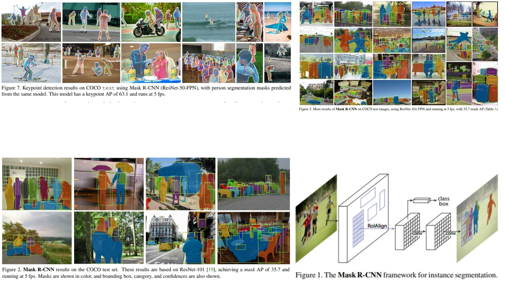

# 🌔 Mask-RCNN PyTorch Replication

This repository contains a **clean and modular PyTorch reproduction of Mask R-CNN**, based on the original paper.  
The project focuses only on the **core detection + instance segmentation pipeline**, intentionally avoiding training tricks (long schedules, COCO helpers, etc.) to keep the implementation minimal.

- Backbone: ResNet feature maps (C2–C5), **no FPN fusion**
- Region Proposal Network (RPN)
- RoIAlign (no quantization)
- Parallel heads:
  * classification
  * bounding-box regression
  * instance mask (lightweight convolutional branch)

> **Note on Mask-R-CNN:** The original Mask R-CNN integrates a Feature Pyramid Network (FPN) to enhance multi-scale representation. This implementation does not include the FPN module and instead relies on a single-level backbone feature map. The design is intentionally minimal to keep the code easier to study and extend.

**Paper reference:** [Mask R-CNN*, He et al., 2017](https://arxiv.org/abs/1703.06870) 🍡

---

## 🪼 Overview – Mask R-CNN



> Mask R-CNN — overview  
A two-stage instance segmentation system built on Faster R-CNN. The backbone produces a feature pyramid, the RPN generates candidate object regions, and RoIAlign extracts spatially aligned features for each region. These features are processed by three parallel heads: a classifier to assign a category, a bounding-box regressor to refine the localization, and an FCN-style branch that predicts a high-resolution binary mask for every detected instance. In contrast to semantic segmentation, masks are produced per-object and do not mix classes, enabling precise instance-level delineation on top of standard detection.  


---

## 🧠 Key mathematical snippets

**1. RPN objectness**

$$p^\* \in \{0,1\},\quad L_{obj} = -\,p^\* \log p - (1-p^\*)\log(1-p)$$


**2. Bounding box regression**

$$L_{bbox}= \sum_{i\in \{x,y,w,h\}} smooth_{L1}(t_i - t_i^\*)$$


**3. Multi-task loss**

$$L = L_{cls} + L_{bbox} + L_{mask}$$


**4. Mask per class**

$$M_k \in \mathbb{R}^{28\times28},\qquad \text{choose } k=\arg\max(c)$$


(Each category keeps its own binary mask channel; unlike semantic segmentation, masks do not mix classes.)

---

## 🏗 Project layout

```bash
MaskRCNN-Replication/
│
├── src/
│   ├── layers/
│   │   ├── conv_block.py           # Conv + BN + ReLU
│   │   ├── residual_block.py       # ResNet-style residual block
│   │   ├── fpn_block.py            # Conv + upsample + lateral connections for FPN
│   │   ├── rpn_conv.py             # Conv layers for RPN (objectness + bbox)
│   │   ├── roi_align.py            # RoIAlign (bilinear interpolation)
│   │   ├── mask_fcn.py             # Fully conv layers for per-pixel mask prediction
│   │   └── box_fc.py               # FC layers for class + bbox prediction
│   │
│   ├── modules/
│   │   ├── backbone_resnet.py      # ResNet/ResNeXt backbone
│   │   ├── rpn_module.py           # Full RPN pipeline
│   │   └── roi_processor.py        # Crop, resize, normalize RoI features
│   │
│   ├── model/
│   │   └── maskrcnn_model.py       # Complete pipeline: backbone → RPN → box/mask heads
│   │
│   └── config.py                   # Hyperparameters, anchors, input/output sizes
│
├── images/
│   └── figmix.jpg                  # Figures from Mask R-CNN paper
│
├── requirements.txt                # torch, torchvision, numpy, opencv
└── README.md
```
---


## 🔗 Feedback

For questions or feedback, contact: [barkin.adiguzel@gmail.com](mailto:barkin.adiguzel@gmail.com)
